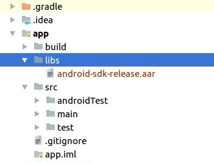

# Android SDK of Diyalog Messaging Platform

Diyalog SDK is used for enabling messaging for your application. It is a multi-platform communication Messaging SDK for mobile and web. It is easy to integrate, save development cost and delight users with a stable, secure and customization messaging. 

### SDK Supports
Diyalog SDK supported with Android 4.0.3(API level 15) & Above

### Features

  - One-to-One Chat 
  - Group Chat
  - Send text message
  - Send Media file (Audio, Video, Image)
  - Send Location
  - Share Contact
  - Audio Call

### Configuration Steps
**Step 1:** Download Diyaload SDK (android-sdk-release.aar) from …….<br />
**Step 2:** Copy the aar file and put it under app module's libs folder. As shown in below Screen shot.<br />

<br />

**Step 3:** Open Project level build.gradle file and add “flatDir{dirs 'libs'}”as shown below.

```sh
allprojects {
	repositories {
		jcenter()
		flatDir {
			dirs 'libs'//this way we can find the .aar file in libs folder
		}
	}
}
```
**Step 4:** Open application level build.grdle file. <br />

**a. set compile and target sdk version to 26 and above**
```sh
compileSdkVersion 26
    defaultConfig {
        --
        minSdkVersion 15
        targetSdkVersion 26
        --
    }
```

**b. Add the following dependencies**
```sh
dependencies {
	compile (name:'android-sdk-release', ext:'aar')

        // Calls
        compile 'io.pristine:libjingle:11139@aar'
	// UI
	compile 'com.facebook.fresco:fresco:0.7.0'
	compile 'com.facebook.rebound:rebound:0.3.8'
	compile 'com.soundcloud.android:android-crop:1.0.0@aar'
	compile('com.github.chrisbanes.photoview:library:1.2.4') {
		exclude module: 'support-v13'
	}
	compile 'com.droidkit:progress:0.5'
	compile 'com.getbase:floatingactionbutton:1.9.1'
	// Core
	compile 'com.squareup.okhttp3:okhttp:3.9.1'
	compile 'org.eclipse.paho:org.eclipse.paho.client.mqttv3:1.0.2'
	// Android Support
        compile 'com.android.support:support-v13:26.1.0'
        compile 'com.android.support:appcompat-v7:26.1.0'
        compile 'com.android.support:palette-v7:26.1.0'
        compile 'com.android.support:recyclerview-v7:26.1.0'
        compile 'com.android.support:design:26.1.0'
        compile 'com.android.support:customtabs:26.1.0'
        compile 'com.google.android.gms:play-services-maps:8.4.0'
}
```

**Step 5:** Add below code at bottom of application level build.gradle files.This code require because support library version 26 and above are missing **AnimatorCompatHelper** class for animation, and do not change **details.useVersion '25.3.0'** version number.

```sh
configurations.all {
    resolutionStrategy.eachDependency { DependencyResolveDetails details ->
        def requested = details.requested
        if (requested.group == 'com.android.support') {
            if (!requested.name.startsWith("multidex")) {
                details.useVersion '25.3.0'
            }
        }
    }
}
```

**Step 6:** Open your project AndroidManifest.xml file and add below line of code inside <application> tag.

```sh
<meta-data
	android:name="com.google.android.geo.API_KEY"
	android:value="YOUR_API_KEY_HERE" />
```

**Note** : Replace **YOUR\_API\_KEY\_HERE** with your actual **Map API** key which you will get from your google Api console
To get Map API key please check this

**Link :** **https://developers.google.com/maps/documentation/android-api/signup**

**Step 7:**  Add below permissions into AndroidManifest.xml file.

```sh
<uses-permission android:name="android.permission.INTERNET" />
<uses-permission android:name="android.permission.ACCESS_NETWORK_STATE" />
<uses-permission android:name="android.permission.WRITE_EXTERNAL_STORAGE" />
<uses-permission android:name="android.permission.INTERACT_ACROSS_USERS_FULL" />
<uses-permission android:name="android.permission.GET_ACCOUNTS" />
<uses-permission android:name="android.permission.MANAGE_ACCOUNTS" />
<uses-permission android:name="android.permission.AUTHENTICATE_ACCOUNTS" />
<uses-permission android:name="android.permission.READ_CONTACTS" />
<uses-permission android:name="android.permission.WRITE_CONTACTS" />
<uses-permission android:name="android.permission.WAKE_LOCK" />
<uses-permission android:name="android.permission.RECORD_AUDIO" />
<uses-permission android:name="android.permission.VIBRATE" />
<uses-permission android:name="android.permission.ACCESS_COARSE_LOCATION" />
<uses-permission android:name="android.permission.ACCESS_FINE_LOCATION" />
<uses-permission android:name="android.permission.READ_PROFILE" />
<uses-permission android:name="android.permission.SYSTEM_ALERT_WINDOW" />
<uses-permission android:name="android.permission.CAMERA" />
<uses-permission android:name="android.permission.MODIFY_AUDIO_SETTINGS" />
<uses-permission android:name="android.permission.LOCATION_HARDWARE" />
<uses-permission android:name="com.android.launcher.permission.INSTALL_SHORTCUT" />
<uses-permission android:name="android.permission.RECEIVE_BOOT_COMPLETED" />

<uses-feature
android:glEsVersion="0x00020000"
android:required="true" />
<uses-feature
android:name="android.hardware.telephony"
android:required="false" />
<uses-feature
android:name="android.hardware.bluetooth"
android:required="false" />
<uses-feature
android:name="android.hardware.camera"
android:required="false" />
<uses-feature
android:name="android.hardware.location"
android:required="false" />
<uses-feature 
android:name="android.hardware.microphone"
android:required="false" />
```

**Step 8:** Create Application class and extend it **withDiyalogEngineApplication**. And override **onConfigureDiyalogEngine()** method.
Inside that method set below configure.<br />
**a. Set Server End Point:**
```sh
DiyalogEngine.diyalogInstance().setEndpoints(new String[]{"YOUR_SERVER_URL_HERE"});
```
**b. Set Custom theme color:**
```sh
DiyalogStyle style = DiyalogEngine.diyalogInstance().style;
style.setMainColor(Color.parseColor("#42f47a"));    
```

**c. Set Configurable following parameter :**

-  Set enable/disable audio call funcation
-  Set Application name
-  Invite URL
-  Help line number
-  Privacy policy text/URL
-  Terms and condition text/URL

### Full Code:
```sh
public class DiyalogApplication extends DiyalogEngineApplication {
	@Override
	public void onConfigureDiyalogEngine() {


		// set here your end point
		DiyalogEngine.diyalogInstance().setEndpoints(new String[]{"YOUR_SERVER_URL_HERE "});

		// set here you application theme color
		DiyalogStyle style = DiyalogEngine.diyalogInstance().style;
		style.setMainColor(Color.parseColor("#FFFF4081"));
	}
}
```
Do not forget to mention application class  in **AndroidManifest.xml** inside **<application>** tag using **android:name** property.

**Step 9:** Now you have done with integration steps, Add below code for open chat screen from your application.  This will first check user authentication is completed or not, First time it will ask for login screen and after authentication complete it will open chat screen. Follow below steps

- **a.** import messenger class **“import static im.diyalog.sdk.util.DiyalogEngineMessenger.messenger;”**
- **b.** And code for start chat screen<br />

```sh
btnStartChat.setOnClickListener(new View.OnClickListener() {
	@Override
	public void onClick(View v) {
		if (messenger().getAuthState() != AuthState.LOGGED_IN) {
			Bundle authExtras = new Bundle();
			authExtras.putInt(AuthActivity.SIGN_TYPE_KEY, AuthActivity.SIGN_TYPE_UP);
			DiyalogEngine.diyalogInstance().getActivityManager().startAuthActivity(MainActivity.this, authExtras);
			finish();
			return;
		}
	DiyalogEngine.diyalogInstance().startMessagingApp(MainActivity.this);
	finish();
	}
});
```
