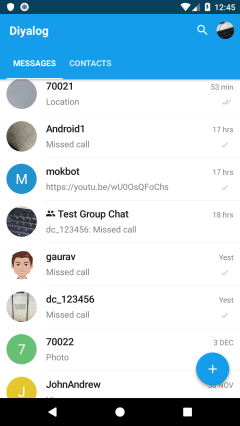

# Diyalog Android SDK Style

Diyalog SDK provides custom Diyalog style to your application, using Diyalog style customer can create own styled screen.

### How to use custom style?
First create object of DiyalogStyle class from your application class, and using that object you can access all property of DiyaLogStyle class.

  - Diyalog style is optional. If customer don't wants to use custom style then SDK will use default style

### Sample code:
```sh
 DiyalogStyle style = DiyalogEngine.diyalogInstance().style;
 style.setMainColor(Color.parseColor("#139dea")); 
```

**Followings are styles parameters with the help of those parameters User can configure style within their Application:**<br />

**1. Common**

   * To set Application main theme color(Theme color)
     * style.setMainColor(Color.parseColor("#f442d4"));
     * Default color theme  in SDK - "#4d74a6"
     * This color is used for text and icon in an Application, if user not set any other style parameter then SDK will use theme color as a base.<br />	
         
   * To set custom background image in chat(conversation) screen
     * style.setDefaultBackgrouds(new int[]{im.diyalog.sdk.R.drawable.intro_background, R.drawable.img_chat_background_default, R.drawable.bg_1, R.drawable.bg_2});
     * Customer can use multiple images
     * If customer set background by using setDefaultBackground method then user can see all background images in Setting screen, by default SDK will set first image as background but customer can change from list of background from setting screen.<br />
         
   * To set toolbar(Header) background color
     * style.setToolBarColor(R.color.picker_main_color);
     * By default SDK will set the color which user has defined in setMainColor method.<br />
        
   * To set floating button background  color based on User action as mentioned below.
     * Normal
       * style.setFabColor(Color.parseColor("#77a358"));
       * Customer can customize normal fab background color
       * Diyalog SDK change all fab background color
     * Pressed
       * style.setFabPressedColor(Color.parseColor("#a27e57"));
       * Diyalog SDK change all pressed fab background color.<br />
        
   * To set screen background color when options are visible to user on click of floating button.
     * style.setMainFabbgColor(Color.parseColor("#33dd0d1e"));
     * When click on fab icon show sub items, SDK will change background color for subitems. <br />
        
   * To set application background color in all screen
     * style.setMainBackgroundColor(Color.parseColor("#bcc6b8")); <br />
        
   * To set place holder background color for user cover avtar Image
     * style.setAvatarBackgroundColor(Color.parseColor("#139dea"));
   * To set place holder background image for user cover avtar Image
     * style.setAvatarBackgroundResource(R.drawable.bg_1);
     * **Note:** If you set both color and image resource for user placeholder then SDK will accept avatar image resource as a place holder

**2. Customise toolbar**

Diyalog SDK provides custom Toolbar style to your application, using this customise you can set toolbar and statusbar same as your main application.

##### How to use custom toolbar?
First create object of DiyalogStyle class from your application class, and using that object you can customise toolbar.


##### Sample code:
```sh
 DiyalogStyle style = DiyalogEngine.diyalogInstance().style;
```

**Following are cases in which Client can customise toolbar in sdk:** 

**- Set gradient background for toolbar and statusbar**

   * style.setGradientToolbar(R.drawable.gradient_bg);
     * Client need to create gradient drawable file into main application, and need to pass this file refrence as a configurable parameter. 
          
 

**- Set background color for toolbar and statusbar**

   * style.setMainColor(Color.parseColor("#139dea"));
     * By default Main color of application theme will set as a toolbar & statusbar color 
          
 
   * style.setStatusBarColor(Color.parseColor("#e00b52"));
     * This will change only statusbar color of sdk. 
          
 
   * style.setToolBarColor(R.color.picker_main_color);
     * This will change only toolbar color of sdk. 
           
 
   * **Note:** If you will set gradient background configuration then above configuration will not be apply effact. 
	
**3. Setting**

   * To set setting screen label and text color
     * style.setSettingsCategoryTextColor(Color.parseColor("#f28e02"));
     * By default SDK will set the color which user has defined in setMainColor method.
   * To set setting screen icon color
     * style.setSettingsIconColor(Color.parseColor("#e00b52")); 
   * To set setting screen title color
     * style.setSettingsTitleColor(Color.parseColor("#5622b7"));  <br />
        

**4. Dividers**

   * To set divider color to list in application 
     * style.setDividerColor(Color.parseColor("#e00b52"));
     * This divider color will apply to whole application as divider color. <br />
        

**5. Text color**

   * Set primary text color
     * style.setTextPrimaryColor(Color.parseColor("#e00b52"));
   * Set secondary color
     * style.setTextSecondaryColor(Color.parseColor("#0a0ed8")); <br />
         
   * Set hint color
     * style.setTextHintColor(Color.parseColor("#ede50e")); <br />
        
   * Set sub header color
     * style.setTextSubHeaderColor(Color.parseColor("#f49e42"));<br />
        
     * In above image see text color of label "Long press for additional options"


**6. Contact screen(contact tab of main screen)**

   * set share icon and text color 
     * style.setActionShareColor(Color.parseColor("#0a0ed8"));
     * By default SDK will set the color which user has defined in setMainColor method.
   *  set short name(First character) text color
     * style.setContactFastTitleColor(Color.parseColor("#e00b52"));
     * By default SDK will set the color which user has defined in setMainColor method.
   * set Add contact icon and text color
     * style.setActionAddContactColor(Color.parseColor("#0a0ed8"));
     * By default SDK will set the color which user has defined in setMainColor method.
   * set list divider color
     * style.setContactDividerColor(Color.parseColor("#ede50e"));
     * if customer has not set contact divider color then it will accept default divider color which user has set in “setDividerColor” method<br />
        

**7. Chat screen (Chat tab from home screen)**


   * Set indicator color of sent message
     * style.setDialogsStateSentColor(Color.parseColor("#0794ed")); 
   * Set indicator color of delivered message
     * style.setDialogsStateDeliveredColor(Color.parseColor("#edd607")); 
   * Set indicator color of read message
     * style.setDialogsStateReadColor(Color.parseColor("#edd607")); <br />
        
   * Set counter text color of unread message count
     * style.setDialogsCounterTextColor(Color.parseColor("#f48004"));
   * Set counter background color for unread message count
     * style.setDialogsCounterBackgroundColor(Color.parseColor("#120be0"));<br />
        
   * Set text color for last conversation message time
     * style.setDialogsTimeColor(Color.parseColor("#c62e0f")); 
   * set divider color between chat list
     * style.setDialogsDividerColor(Color.parseColor("#e0120b"));
     * By default SDK show default divider color
   * Set text color for contact name
     * style.setDialogsTitleColor(Color.parseColor("#4a8413"));
     * By default SDK show primary color
   * Set last message which is either sent or receive text color
     * style.setDialogsTextColor(Color.parseColor("#a8a579"));
     * By default SDK show main theme color
   * Set typing label text color which indicates user is typing a message.
     * style.setDialogsTypingColor(Color.parseColor("#40000000"));
     * By default SDK show main theme color<br />
        
   * Set last message text color of content type media and document
     * style.setDialogsActiveTextColor(Color.parseColor("#db2a0a"));<br />
        

        

**8. Friends Profile/ Group profile**

   * Set title color of friendName and groupName text color
     * style.setProfileTitleColor(Color.parseColor("#139dea"));
   * subtitle color (Last seen text color)
     * style.setProfileSubtitleColor(Color.parseColor("#139dea"));
   * contact icon color
     * If not set then it will show default action icon color 
     *  style.setProfileContactIconColor (Color.parseColor("#139dea"));
   * To set action icon color(action icon like :- Add contact, new message, voice call) 
     * style.setListActionColor(Color.parseColor("#db2a0a")); 
     * By default SDK will set the color which user has defined in setMainColor method.
   * Small icon color 
     * style.setSectonIconSmallColor(Color.parseColor("#0a0ed8"));
     * By Default color for small icon is "# b5b6b7"<br />
        


**9. Group profile**

   * Set admin label text color 
     * If not pass then set default Accent color
     * style.setGroupAdminColor(Color.parseColor("#0cd341")); 
   * set online label text color into group profile screen for members list 
     *  style.setGroupOnlineColor(Color.parseColor("#380249")); <br />
        

**10. Conversation(Chat Detail)**

   * set enable send message icon color
     * style.setConvSendEnabledColor(Color.parseColor("#0cd341")); 
   * Set disable send message icon color
     * style.setConvSendDisabledColor(Color.parseColor("#db2a0a"));
   * Set date text color 
     * style.setConvDatetextColor(Color.parseColor("#db0be2")); 
   * Set date text background color 
     * style.setConvDateBgColor(Color.parseColor("#18d8e2")); 
   * Set chat message color
     * style.setConvTextColor(Color.parseColor("#db2a0a"));
   * Set chat message date color
     * style.setConvTimeColor(Color.parseColor("#0cd341"));
   * Set sent message indicator color 
     * style.setConvStateSentColor(Color.parseColor("#40000000"));
   * Set delivered message indicator color
     * style.setConvStateDeliveredColor(Color.parseColor("#40000000"));
   * Set read message indicator color
     * style.setConvStateReadColor(Color.parseColor("#ff7ea8ef"));
   * Set media chat message date icon color
     * style.setConvMediaDateBgColor(Color.parseColor("#99000000"));
   * Set pending media chat message indicator color
     * style.setConvMediaStatePendingColor(Color.parseColor("#ffffff"));
   * Set sent media chat message indicator color
     * style.setConvMediaStateSentColor(Color.parseColor("#ffffff"));
   * Set deliver media chat message indicator color
     * style.setConvMediaStateDeliveredColor(Color.parseColor("#ffffff"));
   * Set read media chat message indicator color
     * style.setConvMediaStateReadColor(Color.parseColor("#ff7ea8ef"));
   * Set favorite chat message icon color
     * style.setConvLikeColor(Color.parseColor("#e2264d"));<br />
        


