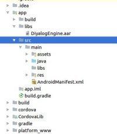

### Details steps to add DiyalogSDK Cordova plugin to ionic application
You need to configure cordova plugin in ionic application to access native functions in javascript file.

You can find below details about how you can create ionic project and create cordova plugin for Diyalog SDK.
    
1. [Create ionic project](CreateIonicProject/README.md) 
    
    _You can skip it. If you have already an ionic/cordova project._
    
1. [Create ionic project](CreateCordovaPlugin/README.md) 
    
    _You can skip it. You can find DiyalogSDK Cordova plugin in directory [Plugin](../Plugin)._

### Configuration Steps
**Step 1:** Download "DiyalogChat" plugin and put it on your ionic project root directory. 

**Step 2:** Add this plugin to ionic sample application.

```sh
/workspace/MyIonicApp$ cordova plugin add DiyalogChat/
```

Once done, in config.xml in the root folder, our plugin is added.
```sh
<plugin name="im.diyalog.ionicplugin" spec="DiyalogChat" />
```

**Step 3:** If you wants to remove plugin after added from project then you can use below command:
* First, you should list your plugins:


```sh
/workspace/MyIonicApp$ cordova plugin list
cordova-plugin-device 2.0.1 "Device"
cordova-plugin-ionic-keyboard 2.0.5 "cordova-plugin-ionic-keyboard"
cordova-plugin-ionic-webview 1.2.0 "cordova-plugin-ionic-webview"
cordova-plugin-splashscreen 5.0.2 "Splashscreen"
cordova-plugin-whitelist 1.3.3 "Whitelist"
im.diyalog.ionicplugin 1.0.0 "DiyalogChat"
```

* With this result, you can simply do:

```sh
workspace/MyIonicApp$ cordova plugin remove im.diyalog.ionicplugin
```

**Step 4:** Now for adding this installed plugin in android platform follow below command:

```sh
/workspace/MyIonicApp$ cordova platform add android
```

* If you already added android platform to ionic app, you can update platform with below command.

```sh
/workspace/MyIonicApp$ cordova plugin save
/workspace/MyIonicApp$ cordova platform rm android
/workspace/MyIonicApp$ cordova platform add android
```

* After adding android platform you can see plugin file into android platform<br />
/workspace/MyIonicApp/platforms/android/app/src/main/java/im/diyalog/ionicplugin/DiyalogChat.java

**Step 5:** Now call this plugin from your ionic application.
* Add button to your ionic application. I have added button into **home.html** file

```sh
  <button  ion-button secondary menuToggle (click)="openDiyalogChat()">Start Messaging</button>
```

* now open **home.ts** file
  - Add "platform" parameter in import section:<br />
      import { NavController,**Platform** } from 'ionic-angular';
  - Declare cordova variable:<br /> 
      **declare var cordova: any;**
  - Add Platform variable in constructor:<br />
      constructor(public navCtrl: NavController, **public platform: Platform**)
  - Create function for open Diyalog chat

```sh
        openDiyalogChat() {
          this.platform.ready().then(() => {
           cordova.plugins.DiyalogChat.coolMethod();
          });
        }
```

  - You can see Whole file

```sh
        import { Component } from '@angular/core';
        import { NavController,Platform } from 'ionic-angular';
        declare var cordova: any;
        @Component({
         selector: 'page-home',
         templateUrl: 'home.html'
        })
        export class HomePage {

         constructor(public navCtrl: NavController, public platform: Platform) {
         }

         openDiyalogChat() {
          this.platform.ready().then(() => {
           cordova.plugins.DiyalogChat.coolMethod();
          });
         }
        }
```


**Step 6:** Now run ionic app with below command

```sh
workspace/TestIonicApp$ ionic cordova run android
```

* You can also import this project in android studio. Go to android studio and select option **import project** and select android project from platform directory.
**MyIonicApp/platforms/android**. 

After run application when you click on **Start Messaging** button you can see **welcome to diyalog** screen.


# How to configure diyalog sdk into your android application

### Configuration Steps
**Step 1:** Download Diyaload SDK (DiyalogEngine.aar) from …….<br />
**Step 2:** Copy the aar file and put it under app module's libs folder. As shown in below Screen shot.<br />

<br />

**Step 3:** Open Project level build.gradle file and add “flatDir{dirs 'libs'}”as shown below.

```sh
allprojects {
	repositories {
		jcenter()
		flatDir {
			dirs 'libs'//this way we can find the .aar file in libs folder
		}
	}
}
```
**Step 4:** Open module level build.grdle file. <br />

**a. set compile and target sdk version to 26 and above**

```sh
compileSdkVersion 26
    defaultConfig {
        --
        minSdkVersion 15
        targetSdkVersion 26
        --
    }
```

**b. Add the following dependencies**

```sh
dependencies {
	
        implementation fileTree(dir: 'libs', include: '*.jar')
        // SUB-PROJECT DEPENDENCIES START
        implementation(project(path: ":CordovaLib"))
        // SUB-PROJECT DEPENDENCIES END

        implementation 'com.android.support:appcompat-v7:26.1.0'
        implementation 'com.android.support:appcompat-v7:26.1.0'
        implementation 'com.android.support.constraint:constraint-layout:1.0.2'
        testImplementation 'junit:junit:4.12'
        androidTestImplementation 'com.android.support.test:runner:1.0.1'
        androidTestImplementation 'com.android.support.test.espresso:espresso-core:3.0.1'

        compile (name:'DiyalogEngine', ext:'aar')

        // Calls
        compile 'io.pristine:libjingle:11139@aar'

        // UI
        compile ('com.facebook.fresco:fresco:0.7.0'){
         exclude group: 'com.parse.bolts', module: 'bolts-android'
         exclude group: 'com.nineoldandroids', module: 'library'
         exclude group: 'com.android.support'
        }

        compile 'com.facebook.rebound:rebound:0.3.8'

        compile 'com.soundcloud.android:android-crop:1.0.0@aar'
        compile('com.github.chrisbanes.photoview:library:1.2.4') {
          //        exclude module: 'support-v13'
           exclude group: 'com.android.support'
        }

        compile 'com.droidkit:progress:0.5'
        compile ('com.getbase:floatingactionbutton:1.9.1'){
          exclude group: 'com.android.support', module: 'support-annotations'
        } 


        // Core
        compile 'com.squareup.okhttp3:okhttp:3.9.1'
        compile 'org.eclipse.paho:org.eclipse.paho.client.mqttv3:1.0.2'

        // Android Support
        //compile 'com.android.support:support-v4:23.1.0'
        //compile 'com.android.support:support-v13:26.1.0'
        compile 'com.android.support:appcompat-v7:26.1.0'
        compile 'com.android.support:palette-v7:26.1.0'
        compile ('com.android.support:recyclerview-v7:26.1.0'){
          exclude module: 'support-annotations'
          exclude module: 'support-v4'
        }
        compile ('com.android.support:design:26.1.0'){
          exclude module: 'support-v4'
          exclude module: 'recyclerview-v7'
          exclude module: 'appcompat-v7'
        }
        compile 'com.android.support:customtabs:26.1.0'
        compile 'com.google.android.gms:play-services-maps:11.8.0'
   }
```

**Step 5:** Add below code at bottom of module level build.gradle files.This code require because support library version 26 and above are missing **AnimatorCompatHelper** class for animation, and do not change **details.useVersion '25.3.0'** version number.

```sh
configurations.all {
    resolutionStrategy.eachDependency { DependencyResolveDetails details ->
        def requested = details.requested
        if (requested.group == 'com.android.support') {
            if (!requested.name.startsWith("multidex")) {
                details.useVersion '25.3.0'
            }
        }
    }
}
```

**Step 6:** Open your project AndroidManifest.xml file and add below line of code inside <application> tag.

```sh
<meta-data
	android:name="com.google.android.geo.API_KEY"
	android:value="YOUR_API_KEY_HERE" />
```

**Note** : Replace **YOUR\_API\_KEY\_HERE** with your actual **Map API** key which you will get from your google Api console
To get Map API key please check this

**Link :** **https://developers.google.com/maps/documentation/android-api/signup**

**Step 7:**  Add below permissions into AndroidManifest.xml file.

```sh
<uses-permission android:name="android.permission.INTERNET" />
<uses-permission android:name="android.permission.ACCESS_NETWORK_STATE" />
<uses-permission android:name="android.permission.WRITE_EXTERNAL_STORAGE" />
<uses-permission android:name="android.permission.INTERACT_ACROSS_USERS_FULL" />
<uses-permission android:name="android.permission.GET_ACCOUNTS" />
<uses-permission android:name="android.permission.MANAGE_ACCOUNTS" />
<uses-permission android:name="android.permission.AUTHENTICATE_ACCOUNTS" />
<uses-permission android:name="android.permission.READ_CONTACTS" />
<uses-permission android:name="android.permission.WRITE_CONTACTS" />
<uses-permission android:name="android.permission.WAKE_LOCK" />
<uses-permission android:name="android.permission.RECORD_AUDIO" />
<uses-permission android:name="android.permission.VIBRATE" />
<uses-permission android:name="android.permission.ACCESS_COARSE_LOCATION" />
<uses-permission android:name="android.permission.ACCESS_FINE_LOCATION" />
<uses-permission android:name="android.permission.READ_PROFILE" />
<uses-permission android:name="android.permission.SYSTEM_ALERT_WINDOW" />
<uses-permission android:name="android.permission.CAMERA" />
<uses-permission android:name="android.permission.MODIFY_AUDIO_SETTINGS" />
<uses-permission android:name="android.permission.LOCATION_HARDWARE" />
<uses-permission android:name="com.android.launcher.permission.INSTALL_SHORTCUT" />
<uses-permission android:name="android.permission.RECEIVE_BOOT_COMPLETED" />

<uses-feature
android:glEsVersion="0x00020000"
android:required="true" />
<uses-feature
android:name="android.hardware.telephony"
android:required="false" />
<uses-feature
android:name="android.hardware.bluetooth"
android:required="false" />
<uses-feature
android:name="android.hardware.camera"
android:required="false" />
<uses-feature
android:name="android.hardware.location"
android:required="false" />
<uses-feature 
android:name="android.hardware.microphone"
android:required="false" />
```

**Step 8:** Create Application class and extend it with **DiyalogEngineApplication**. And override **onConfigureDiyalogEngine()** method.
Inside that method set below configure.<br />
**a. Set Server End Point:**

```sh
DiyalogEngine.diyalogInstance().setEndpoints(new String[]{"YOUR_SERVER_URL_HERE"});
```
**b. Set Custom theme color:**

```sh
DiyalogStyle style = DiyalogEngine.diyalogInstance().style;
style.setMainColor(Color.parseColor("#42f47a"));    
```

**c. Set Configurable following parameter :**

-  Set enable/disable audio call funcation
-  Set Application name
-  Invite URL
-  Help line number
-  Privacy policy text/URL
-  Terms and condition text/URL

### Full Code:

```sh
public class DiyalogApplication extends DiyalogEngineApplication {
	@Override
	public void onConfigureDiyalogEngine() {


		// set here your end point
		DiyalogEngine.diyalogInstance().setEndpoints(new String[]{"YOUR_SERVER_URL_HERE "});

		// set here you application theme color
		DiyalogStyle style = DiyalogEngine.diyalogInstance().style;
		style.setMainColor(Color.parseColor("#FFFF4081"));
	}
}
```
Do not forget to mention application class  in **AndroidManifest.xml** inside **<application>** tag using **android:name** property.

**Step 9:** Now you have done with integration steps, Add below code for open chat screen from your application.  This will first check user authentication is completed or not, First time it will ask for login screen and after authentication complete it will open chat screen. Follow below steps

- **a.** import messenger class **“import static im.diyalog.sdk.util.DiyalogEngineMessenger.messenger;”**
- **b.** And code for start chat screen<br />

```sh
public class DiyalogChatActivity extends Activity {

    @Override
    protected void onCreate(Bundle savedInstanceState) {
        super.onCreate(savedInstanceState);
        String package_name = getApplication().getPackageName();
        setContentView(getApplication().getResources().getIdentifier("diyalog_chat_layout", "layout", package_name));

        if (messenger().getAuthState() != AuthState.LOGGED_IN) {
            Bundle authExtras = new Bundle();
            authExtras.putInt(AuthActivity.SIGN_TYPE_KEY, AuthActivity.SIGN_TYPE_UP);
            DiyalogEngine.diyalogInstance().getActivityManager().startAuthActivity(DiyalogChatActivity.this, authExtras);
            finish();
            return;
        }
        DiyalogEngine.diyalogInstance().startMessagingApp(DiyalogChatActivity.this);
        finish();

    }
}

```

Now run application and click on **Start Messaging** button it will open **diyalog sdk with login screen**.


