# iOS SDK of Diyalog Messaging Platform

Diyalog SDK is used for enabling messaging for your application. It is a multi-platform communication Messaging SDK for mobile and web. It is easy to integrate, save development cost and delight users with a stable, secure and customization messaging.

#### SDK Supports

Diyalog SDK supported with iOS 8.0 & Above

#### Features

- One-to-One Chat
- Group Chat
- Send text message
- Send Media file (Audio, Video, Image)
- Send Location
- Share Contact
- Audio Call
- Configuration Steps

#### Configuration Steps

**Step 1: Adding DiyalogEngine to your project**

###### CocoaPods

CocoaPods is the recommended way to add DiyalogEngine to your project.

```sh

// Code to add framework
pod 'DiyalogEngine-iOS', :git => 'https://github.com/diyalog-im/DiyalogEngine_Pod.git'
```

**Step 2:**
Need to make required changes in Capabilities of the project as below:

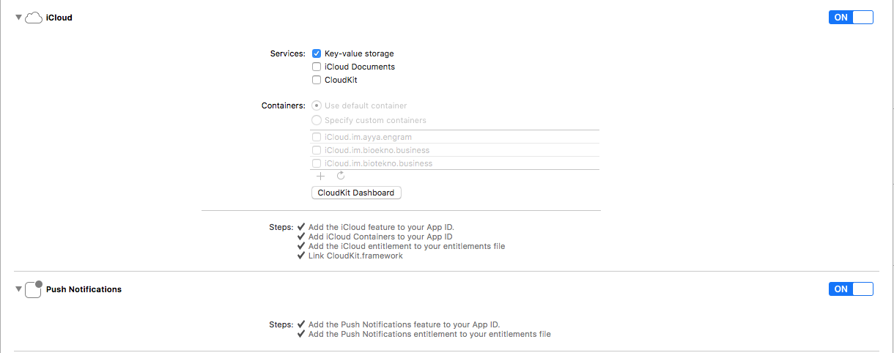


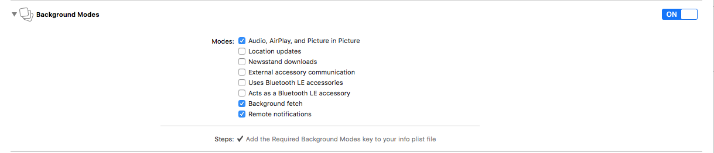


**Step 3:** In your Project, open AppDelegate.swift file and import DiyalogEngine framework. Add override **init()** method, Inside that method set below configure.

**a. Import DiyalogEngine Framework:**

First import `DiyalogEngine` framwork in your AppDelegate and Inherit your AppDelegate class from `DiyalogApplicationDelegate`

```sh
import DiyalogEngine

class AppDelegate: DiyalogApplicationDelegate {

// DiyalogEngine Configuration Code

override init() {
super.init()
}
}
```

**b. Set Server End Point:**

```sh
DiyalogEngine.diyalogInstance().endpoints = ["YOUR_SERVER_URL_HERE"]
```

**c. Set push ID:** You need to set push ID to get push notification while application is closed.

```sh
DiyalogEngine.diyalogInstance().apiPushId = YOUR_PUSH_ID_HERE
```

**Note :** Replace **YOUR_PUSH_ID** with your actual **Push ID** key which you will get from your google console

**d. Set Custom theme color:**

```sh
DiyalogEngine.diyalogInstance().style.navigationTintColor = UIColor(red: 19.0/255.0, green: 157.0/255.0, blue: 234.0/255.0, alpha: 1)
DiyalogEngine.diyalogInstance().style.vcTintColor = UIColor(red: 19.0/255.0, green: 157.0/255.0, blue: 234.0/255.0, alpha: 1)
```

**Note:** Diyalog SDK gives you many customization in the chat views. You can learn details about styling Diyalog in styling document.

**e. Set Configurable following parameter :**

- Set enable/disable audio call funcation
- Set Application name
- Invite URL
- Help line number
- Privacy policy text/URL
- Terms and condition text/URL
- Enable back button on Chat home screen.

#### Full Code:

```sh
import DiyalogEngine

@UIApplicationMain
class AppDelegate: DiyalogApplicationDelegate {

var window: UIWindow?

override init() {
super.init()

// Set here your end point
DiyalogEngine.diyalogInstance().endpoints = ["YOUR_SERVER_URL_HERE"]

// Set here your push id
DiyalogEngine.diyalogInstance().apiPushId = YOUR_PUSH_ID

// Set here your application theme colours
DiyalogEngine.diyalogInstance().style.navigationTintColor = UIColor(red: 19.0/255.0, green: 157.0/255.0, blue: 234.0/255.0, alpha: 1)
DiyalogEngine.diyalogInstance().style.vcTintColor = UIColor(red: 19.0/255.0, green: 157.0/255.0, blue: 234.0/255.0, alpha: 1)
}
}
```

**Step 5:** Now you have done with integration steps, Add below code for open chat screen from your application. This will first check user authentication is completed or not, First time it will ask for login screen and after authentication complete it will open chat screen. Follow below steps.

```sh
@IBAction func btnStartMessagingTapped(_ sender: UIButton) {

// This code will check user already login then,
// fetch last active user id from user default and set as active
if let lastActiveUserId = UserDefaults.standard.value(forKey: ACAuthentication_KEY_LAST_ACTIVEUSER_AUTH_ID) as? jlong {
if lastActiveUserId != 0 {
UserDefaults.standard.set(lastActiveUserId, forKey: ACAuthentication_KEY_AUTH_ID)
}
}

// Set end point
DiyalogEngine.diyalogInstance().endpoints = ["YOUR_SERVER_URL_HERE"]

// Set push id
DiyalogEngine.diyalogInstance().apiPushId = YOUR_PUSH_ID_HERE

// Set navigation bar and view controllers tint colour
DiyalogEngine.diyalogInstance().style.navigationTintColor = UIColor(red: 19.0/255.0, green: 157.0/255.0, blue: 234.0/255.0, alpha: 1)
DiyalogEngine.diyalogInstance().style.vcTintColor = UIColor(red: 19.0/255.0, green: 157.0/255.0, blue: 234.0/255.0, alpha: 1)

// Call this method to setup actors and open chat screen
DiyalogEngine.diyalogInstance().createDiyalog()
DiyalogEngine.diyalogInstance().presentMessengerInNewWindow()
}
```

**Richiew Notificaion Support**

How to add Richview Notification support to your app

Here is the steps for it.

- Go to project expolrer. 

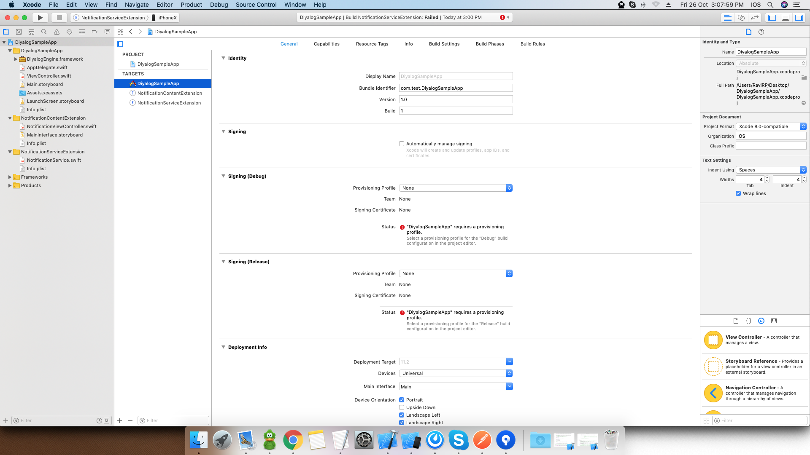
- Add target -> Select "Notification Content Extension".  

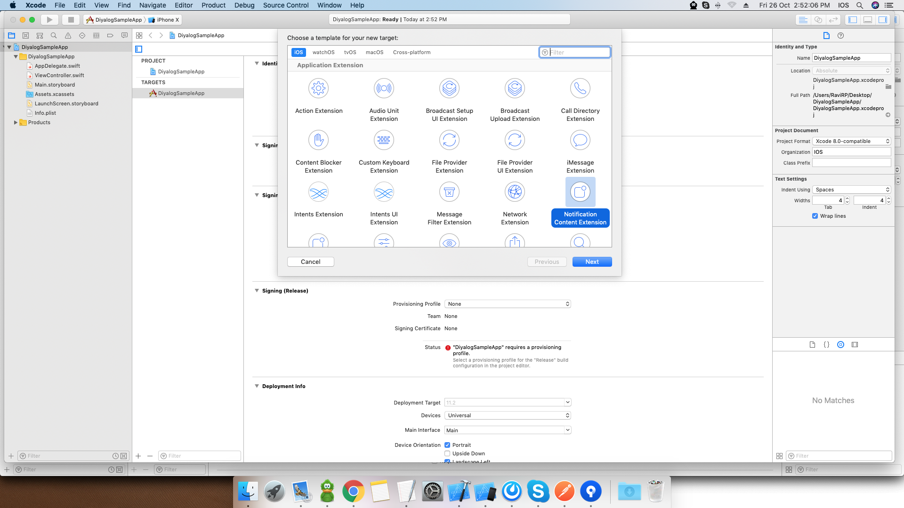

- Give it proper name and press "finish".

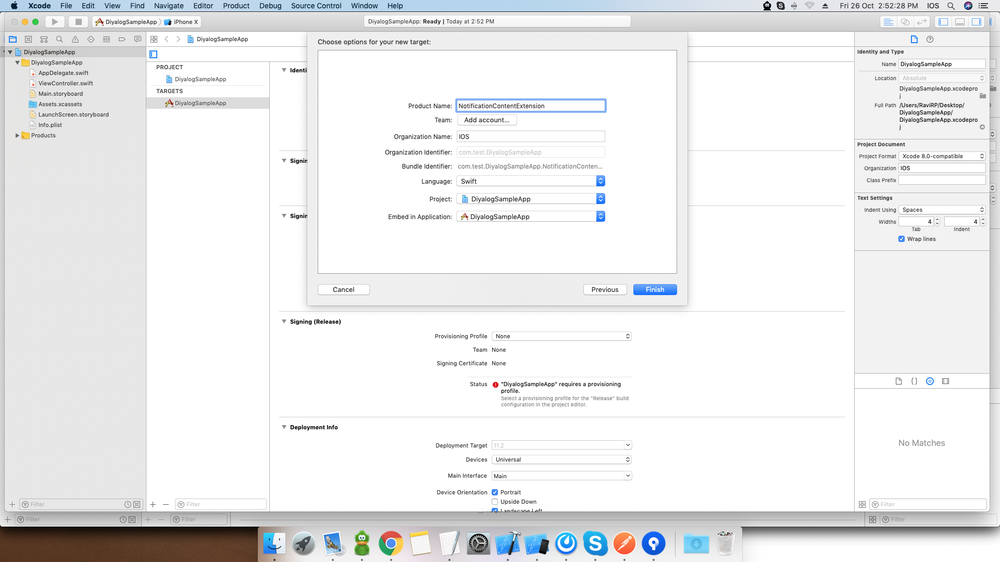

- It will ask for activate to scheme so activate it.

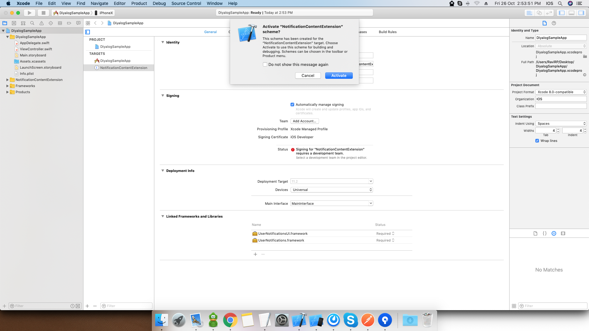

- Add target -> Select "Notification Service Extension".

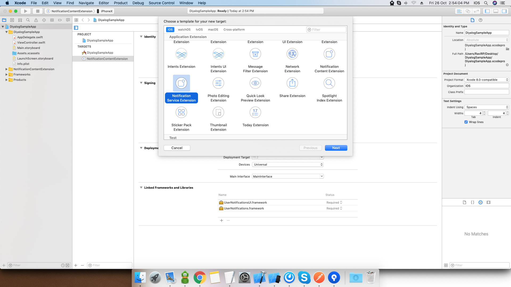

- Give it proper name and press "finish".

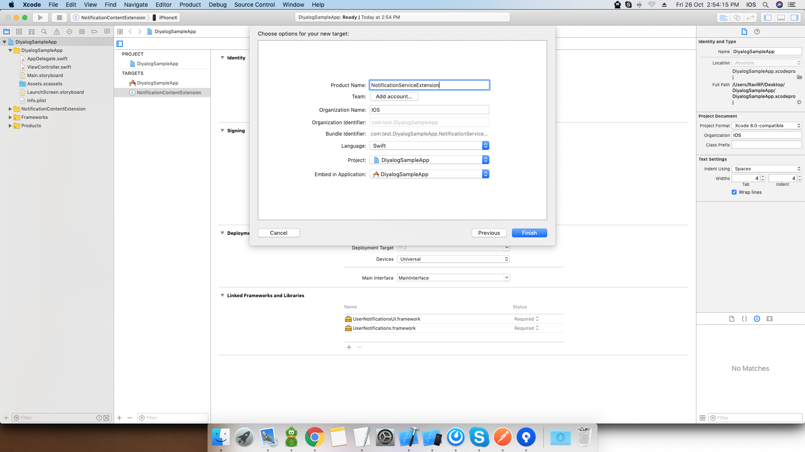

- It will ask for activate to scheme so activate it.

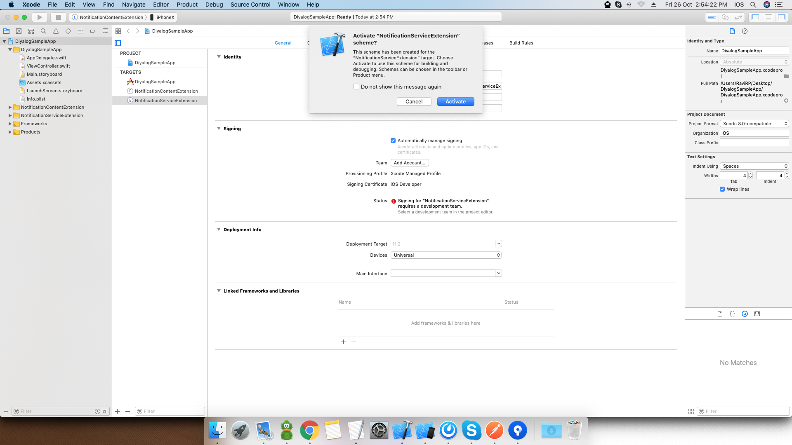


Add DiyalogEngine Framework in both Extension

For that go to project explorar 
- Select NotificationContentExtension target
- Go "Linked Frameworks and Libraries"
- Click Add(+) and choose DiyalogEngine.Framework 

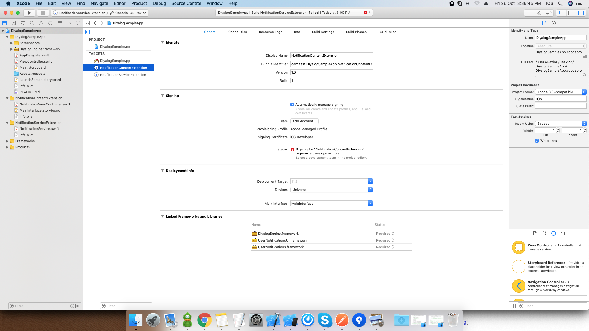

- Same Way add for NotificationServiceExtension 

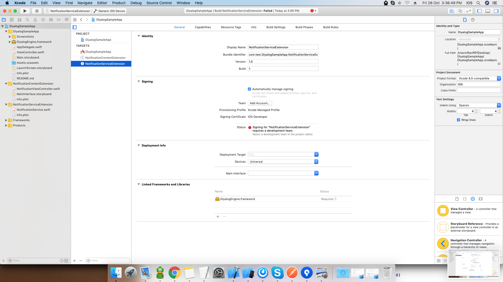


**Select NotificationServiceExtension**

Go to NotificationService.swift and import DiyalogEngine


Replace this method  
```sh
override func didReceive(_ request: UNNotificationRequest, withContentHandler contentHandler: @escaping (UNNotificationContent) -> Void) {
}
```
With this method
```sh
 override func didReceive(_ request: UNNotificationRequest, withContentHandler contentHandler: @escaping (UNNotificationContent) -> Void) {
        self.contentHandler = contentHandler
        bestAttemptContent = (request.content.mutableCopy() as? UNMutableNotificationContent)
        
        if let bestAttemptContent = bestAttemptContent {
            // Modify the notification content here...
            bestAttemptContent.title = "\(bestAttemptContent.title) [modified]"
    
            // Call method to download notification content
            DiyalogEngine.diyalogInstance().didRecieveNotification(bestAttemptContent, withContentHandler: { (attemptContent) in
                    contentHandler(bestAttemptContent)
            })

        }
    }
    
 ```

 
 
**Select NotificationContentExtension**

Go to NotificationViewController.swift  And
```sh
import DiyalogEngine

import AVFoundation 
```

Remove
```@IBOutlet var label: UILabel?  ```


Replace this method  
```sh
func didReceive(_ notification: UNNotification) {
}
```
With this method
```sh
  func didReceive(_ notification: UNNotification) {
        
        // Call method to load image view or player view
        if #available(iOS 10.0, *) {
            DiyalogEngine.diyalogInstance().didReceive(notification: notification, superView: self.view) { (uiView, avPlayer, avAudioPlayer)  in
                if avPlayer != nil {
                    DispatchQueue.main.async {
                        avPlayer?.play()
                    }
                } else if avAudioPlayer != nil {
                    DispatchQueue.main.async {
                        avAudioPlayer?.play()
                    }
                }
            }
        } else {
            // Fallback on earlier versions
        }
    }
 ```


