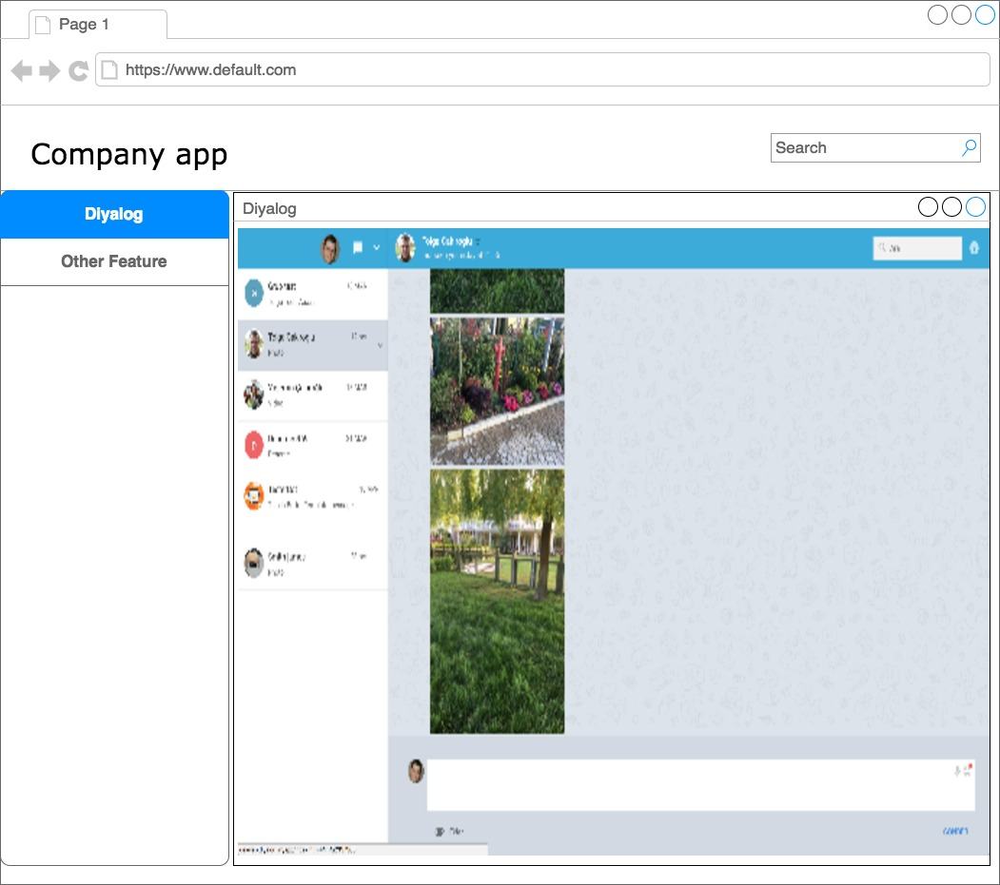

# How to Use Diyalog Web SDK from My AngularJS Web App

You can find the steps on how to configure Diyalog ReactJs component in Angular application component. Besides you can find example Angular application code that use Diyalog SDK in the [diyalog-angular-integration-example](diyalog-angular-integration-example)

1. Create one sample application in angular 5 or you can use existing angular application.

2. Now copy below two script in index.html (root folder)

```sh
    <script src="http://devweb.diyalog.im/app/app_conf.js"></script>

    <script src="http://devweb.diyalog.im/app/app.js"></script>    
```

3. Also copy below html tag in any component where you want to use reactJs component in angular application.

```sh
    <div id="diyalog-app" class="fill"></div>
```
   
   Above html tag will also work as you described in below image where you have other component in left menu.
   
   <p align="center">
     
   </p>


4. Also you will require to copy "assets" folder(in which you have fonts, images, sound files) at root level where index.html file is present. 